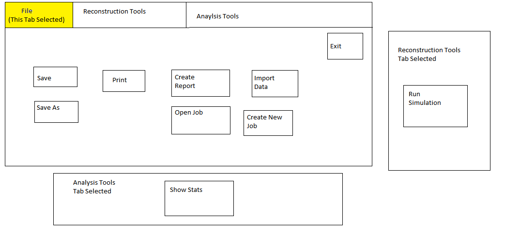
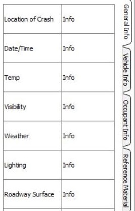
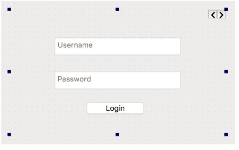

# Design
## Overview
## Environment
## Module Description and Flow
Each tab will have its own class. Each button will have a method associated with it. 

The GUI is separated into four parts. The top ribbon has normal functions (file, save, open) and other basic functions for modeling. There are three tabs. This is the basic layout.

 
This is the basic layout of the top ribbon.

The right portion displays the information retrieved from the database. It has three tabs. These tabs are General Info, Vehicle Info, and Occupant Info. Each Tab will fill up the screen with info when they are clicked. The labels will be to the left and the info to the right.
This has changed from the original design of using tabs.

This is the original design implemented.

 
This is the new design that we will implement soon.

The left portion of the GUI has advanced tools and formulas. 

The center of the application will be used to create the 3D model of the crash.

## Screens

## Use Cases

