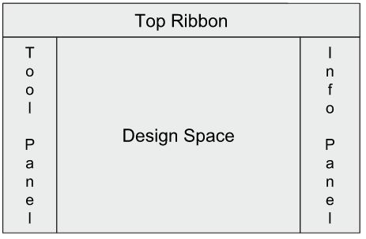
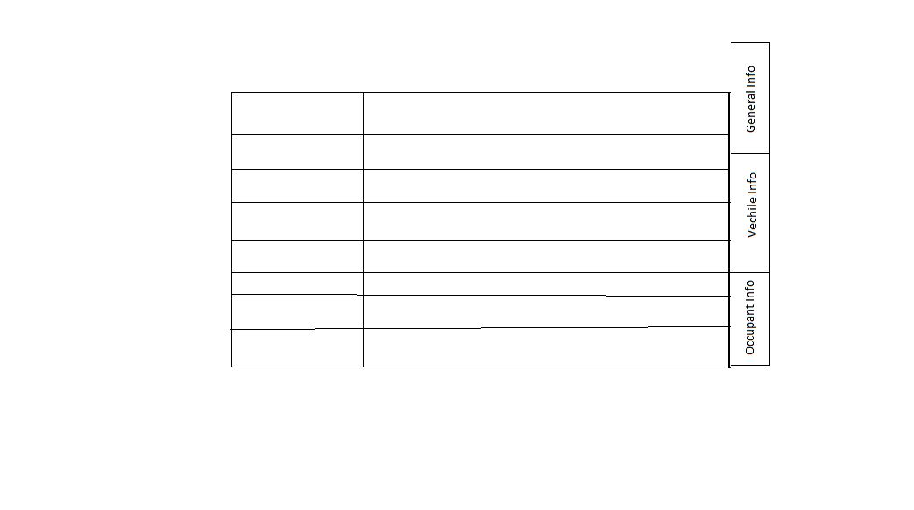

# Design
## Overview
## Environment
## Module Description and Flow
Each tab will have its own class. Each button will have a method associated with it. 

The GUI is separated into four parts. The top ribbon has normal functions (file, save, open) and other basic functions for modeling. There are three tabs. This is the basic layout.

 

The right portion displays the information retrieved from the database. It has three tabs. These tabs are General Info, Vehicle Info, and Occupant Info. Each Tab will fill up the screen with info when they are clicked. The labels will be to the left and the info to the right.
This has changed from the original design of using tabs.

This is the original design implemented.

 

This is the new design that we will implement soon.

 
This is the basic original layout of the top ribbon.

The customer has specified that he wants the top ribbon tabs to be File, Edit, and Draw. On the Edit tab there will be:
  - Undo
  - Redo
  - Cut
  - Copy
  - Paste
  - Select
This tab will have no left side panel.
 On the Draw tab there will be the following buttons:
  - Point
  - Line
  - Polyline
  - Curve
  - Arc
  - Circle
  - Rectangle
  - Photo
  - Fill

The left portion of the GUI has advanced tools and formulas. This will change based upon the tab chosen on the top ribbon.
Shelby is currently working on the design image of this part of the GUI because the customer just provided the specifics on what tools and buttons it should contain. The following is the basic layout and how it will correspond to the top ribbon.
File Tab
  - New
  - Open
  - Save As
  - Save
  - Print
  - Save to Cloud
  - Import
  - Export
  - Close
 
Draw Tab
 
When Point is selected
  - Feet/Metric toggle button
  - Layer
  - X-Coordinate
  - Y-Coordinate
  - Elevation
  - Point to Symbol(drop down arrow with symbols/models found within–symbols will not be populated this semester)
   
When Line is Selected
  - Feet/Metric toggle button
  - Layer
  - length
  - width
  - color
  - starting elevation
  - ending elevation
  - Roadway lines
  - symbols, and symbol spacing
   
When Polyline is Selected
  - Feet/Metric toggle button
  - (2) boxes for types of polylines –polyline and perpendicular polyline
  - layer
  - length
  - width
  - color
  - starting elevation
  - ending elevation
  - roadway lines
  - symbolsand symbol spacing.
   
When Curve is Selected
  - Feet/Metric toggle button
  - (2) boxes for types of curves–fittedand spline
  - layer
  - length
  - width
  - color
  - starting elevation
  - ending elevation
  - roadway lines
  - symbols
   
When Arc is Selected
  - Feet/Metric toggle button
  - (3) boxes for types of arcs–3-point arc
  - 2 points and center arc, and 2-points and angle arc (just below each option for arc–have a box that will display the drawn arc’s center pointx-coordinate& y-coordinate and arc radius)
  - layer
  - length
  - width
  - color
  - starting elevation
  - ending elevation
  - roadway lines
   
When Circle is Selected
  - Feet/Metric toggle button
  - (7) boxes for types of circles–center point and side
  - 2-sides
  - 3-point circle
  - center point and radius
  - 2-tangent line circle
  - ellipse rectangle
  - ellipse axis(just below each option for circles–have a box that will display the drawn circle’s centerpoint x-coordinate& y-coordinate and arc radius)
  - layer
  - length
  - width
  - color
   
When Rectangle is Selected
  - Feet/Metric toggle button
  - (3) boxes for types of rectangles–rectangle
  - irregular polygon
  - irregular cloud (just below each option for circles–have a box that will display the drawn rectangle’sperimeter lengthandarea)
  - layer
  - width of lines and color.
   
When Photo is Selected
  - Browsebutton which will open a file explorer style windowin the center of the screen
   
When Fill is selected
  - Place 2 boxes on the top of the left work panel –Color and Hatch
  - Color will open a full color palletthat a user can drag and drop color from the pallet into a closed box which will fill with this color
  - Hatch will do the same thing, but with textures not colors

The center of the application will be used to create the 3D model of the crash.
This portion will be implemented with the back-end and may not be fully functional by the end of the semester.

